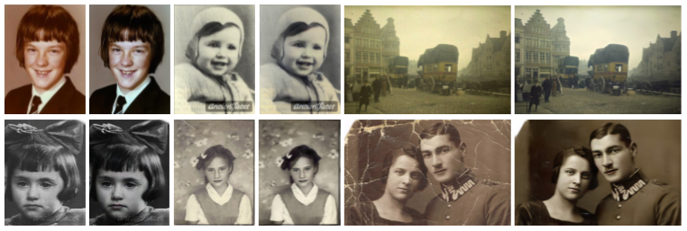
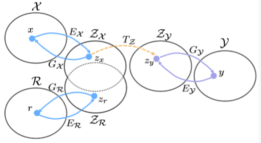
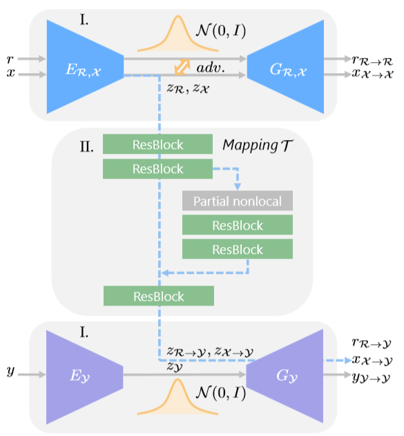

# Deep Latent Space Translation

Image Translation方法在很多领域大有用处。比如：

1. 图像去燥问题
2. 图像复原问题
3. 图像分割迁移问题
4. 医学图像：图像模态转换
5. 医学图像：金属去伪影

本文主要讨论CVPR2020上发表的一篇Oral文章，针对老照片的图像修复应用的一种新的Image Translation方法：

- paper:Old Photo Restoration via Deep Latent Space Translation
- code:[https://github.com/microsoft/Bringing-Old-Photos-Back-to-Life](https://github.com/microsoft/Bringing-Old-Photos-Back-to-Life)

## 摘要

- 提出了一种基于深度学习的被严重损害的老照片的复原方法。
- 无监督方法，无需成对监督学习数据
- 训练两个VAE网络，分别在两个浅空间将老照片转换为干净的照片。
- 两个转换在浅空间形成闭环
- 对于老照片中的多种不同类型损毁：
  - 设计一个全局分支结合部分非局部块，以定位结构化缺损，如划痕和灰尘斑点。
  - 设计一个局部分支定位非结构化缺损，如噪声和模糊。
  - 两个分支在latent space进行融合
- 效果：**图像复原的观感远好于目前的SOTA以及现有的商业工具**

## 相关工作

- 单类型图像损伤的复原
  - 非结构化损伤（unstructed degradation）：噪声，模糊，色彩退化，低分辨率
  - 结构化损伤(structed degradation):空洞，划痕，灰尘斑点
- 混合类型图像损伤的复原
- 面部复原
- 老照片复原

|  非结构化损伤   | 结构化损伤  |
|  ------------  | ---------  |
| 噪声，模糊，色彩退化，低分辨率  | 空洞，划痕，灰尘斑点 |
|  nonlocal self-sumilarity;sparsity;local smooth | learning-based方法 |

## 方法

### 各种Domain和转换关系

下图为图像复原场景中涉及到的几种domain和之间的转换关系。

>图注
>
>- $x$:人工合成老照片图像
>- $y$:与$x$成对的修复clean的图像
>- $r$:真实老照片图像
>- $z_x$:合成老照片图像浅空间变量
>- $z_y$:clean图像浅空间变量
>- $z_r$:真实老图浅空间变量

该方法的关键在于浅空间学习（latent spacing learning）。涉及到两种技术：

1. 浅空间$z_x$和$z_r$的对齐（domain alignment）
2. 浅空间$z_x$或$z_y$到映射（domain mapping）

### 网络结构解析

下图为论文提出的网络结构：

结构中涉及两个VAE网络：

- VAE1可对$x$或$r$进行重建
- VAE2可对$y$进行重建
- VAE1和VAE2的潜变量通过一个Mapping模块$T$实现转换
- $T$：可将$z_X$和$z_R$域内的变量迁移到$z_Y$域
- 图像复原流程：$r$->$z_R$->$z_{R->Y}$->$r_{R->Y}$

### 两个VAE的训练和Loss

具体的，VAE1和和VAE2是单独训练的。

#### VAE重建任务Loss

VAE1由$r$和$x$作为输入进行训练。目标是重建其自身图像。

对于作为重建任务的VAE1，对于输入图像为$r$时，其训练Loss为：

$L_{VAE1}(r)=KL(E_{R,X}(z_r|r)||N(0,I))+\alpha E_{z_r\sim E_{R,X}(z_r|r)[||G_{R,X}(r_{R->R}|z_r)-r||_1]}+L_{VAE1,GAN}(r)$

- 公式三项的优化目标分别是：
  1. latent分布服从高斯分布
  2. 重建Loss，要求latent学到有助于重建输入的特征
  3. 引入LSGAN，解决VAE的过平滑问题，保证重建图像的高真实度

同样的，使用$x$训练VAE1的Loss函数$L_{VAE1}(x)$和上式$L_{VAE1}(r)类似。

VAE2由$y$作为输入进行训练，目标是重建y本身。其训练的Loss函数$L_{VAE2}(y)$形式上和$L_{VAE1}(r)同样没有区别。

#### latent gap reduction Loss

$R$和$X$的浅空间的Domain alignment是非常重要的一步。本文使用对抗训练的思想实现。

为减少$r$和$x$两个latent domain的gap，引入第三个判别器{D_{r,x}}，并涉及latent对抗loss：

$L_{VAE1,GAN}^{latent}(r,x)=E_{x\sim X}[D_{R,X}(E_{R,X}(x))^2]+E_{r \sim R}[1-D_{R,X}(E_{R,X}(R))^2]$

至此，可以得到VAE1的总Loss公式如下：

$\underset{E_{R,X},G_{R,X},D_{R,X}}{min}\underset{D_{R,X}}{max}L_{VAE1}(r)+L_{VAE1}(x)+L_{VAE1,GAN}^{latent}(r,x)$

### Restoration through latent mapping

浅空间进行映射的三个好处：

1. 当$R$和$X$对齐到同一latent space，从$Z_x$到$Z_y$的映射同样适用于从$Z_r$到$Z_y$
2. 浅空间编码特征维度低，相比于高维图像空间更易学习
3. 因为两个VAE是单独训练的，因此两条线路的图像的重建并不会受到各自的影响。$G_y$总是能得到一个干净的图像

训练Mapping模块时，会固定两个VAE的参数，Loss函数由三部分组成：

$L_T(x,y)=\lambda_1L_{T,l_1}+L_{T,GAN}+\lambda_2L_{FM}$

- $L_{T,l_1}=E||T(z_x)-z_y||_1$, 为x的潜变量转换到$Z_Y$后与$z_y$的1范式距离
- $L_{T,GAN}$：对抗Loss，引入LSGAN，使$x_{X->Y}$看上去更真实
- $L_{FM}$：feature matching Loss，也就是perception loss，即要求不仅判别器输出要接近，判别器输出前几层的feature map也要相近

