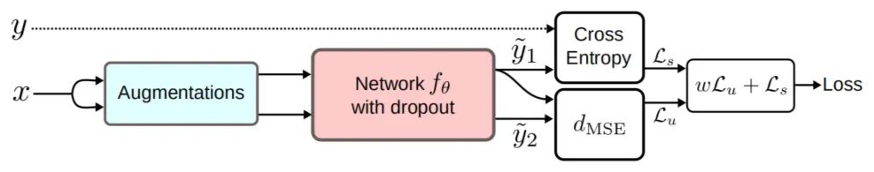

# 基本假设

只有当数据集满足某些假设的前提下，才能使用半监督学习的方法。

## 平滑假设

如果输入样本x1和x2相似，那么他们的标签，或者说对应网络的输出也应该相似。

## 聚类假设

输入数据形成簇，每一个簇对应于一个输出类；如果点在同一个簇中，这些点可被认为为同一类。

也叫低密度分离假设，即：给定的决策边界位于低密度区域。

模型在一些小的扰动的未标记数据上具有一致的预测，以将其判定边界推到低密度区域。

## 流行假设

- 输入空间由多个低维流形组成，所有数据点均位于其上；

- 位于同一流形上的数据点具有相同的标签。

# 一致性正则化（Consistency Regularization）

以上假设，可以简单概括为：对未标记数据应用实际的扰动，预测不应发生显著变化。

具体来说，对输入x和输入的扰动x'，进入网络后的输出之间的距离应该足够小。

流形距离的测量可以用均方误差、KL散度、JS散度等。

## Pi-Model(ICLR2017)

正则化技术（如data augment和dropout等）通常不会改变模型的概率分布。Pi-Model的思想是接受应用了不同正则化技术的输入，然后进行预测得到输出，计算两个输出的距离。网络训练的目的是减小两次预测之间的距离，提升模型在不同扰动下的一致性。

## Temporal Ensembling(ICLR2017)

**论文标题：**Temporal Ensembling for Semi-Supervised Learning

**代码连接**https://github.com/smlaine2/tempens

与Pi-Model类似，Pi-Model是两次计算钱箱计算结果的均方差，反向传播训练网络；TE使用时序组合模型，采用当前模型预测结果和历史预测结果的平均值做均方差计算。有效保留历史信息，消除扰动。

## Mean teachers(NIPS 2017)

**论文标题：**Mean teachers are better role models: Weight-averaged consistency targets improve semi-supervised deep learning results

**代码链接：**https://github.com/CuriousAI/mean-teacher

mean teachers采用对student模型权重进行EMA（exponential moving average）的方式，替换Temporal ensembling对模型预测值进行EMA的形式。

损失函数未有监督和无监督损失之和。

## 无监督数据增广

**论文标题：**Unsupervised Data Augmentation for Consistency Training

**代码链接：**https://github.com/google-research/uda

