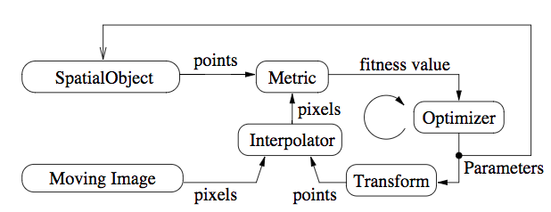
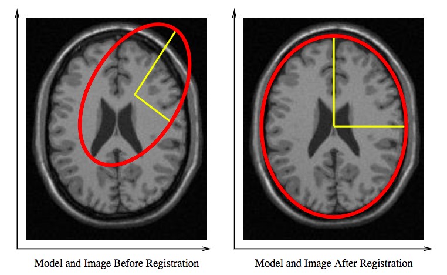

# ITK基于模型的配准算法

这里的模型指的是几何模型。本节首先会讲解如何构建几何模型，并在模型中定义一些参数。

基于模型的配准的目的是，找到最佳的模型参数，使得模型的表示和图像中对应的解剖结构达到比较好的匹配。

给予模型的配准方法的组成框图如下图，它包括一个image，一个空间物体，一个变换，一个相似性测度，一个插值器和一个优化器。


figure-基于模型配准方法的基本框图组成

这里的相似性测度是指图像和模型之间的相似性测度。两者的匹配程度，一方面通过优化空间物体的空间位置、另一方面优化空间物体的内部形状参数。

举例来说，假设我们能近似的讲ct图像中的头骨拟合成一个椭圆。这个椭球就是一个简化的几何模型，配准的目的就是找到这个椭球的中心、长短轴和方向。如下图所示。


figure-将头骨与椭圆几何模型进行配准

本方式最大的优势，相比于图像到图像的配准方法，就是它可以内在的结合解剖结构固有的形状先验信息。

ITK提供了一系列的以SpatialObject为几类的分层次的类，用于构建从简单到复杂的形状模型。并提供了一些基础的功能性函数。

下面将展示一些例子如何使用这一方法。

```cpp
#include "itkEllipseSpatialObject.h"
#include "itkGroupSpatialObject.h"
#include "itkSpatialObjectToImageFilter.h"

#include "itkImageToSpatialObjectMetric.h"

#include "itkLinearInterpolateImageFunction.h"

#include "itkEuler2DTransform.h"

#include "itkOnePlusOneEvolutionOptimizer.h"


```