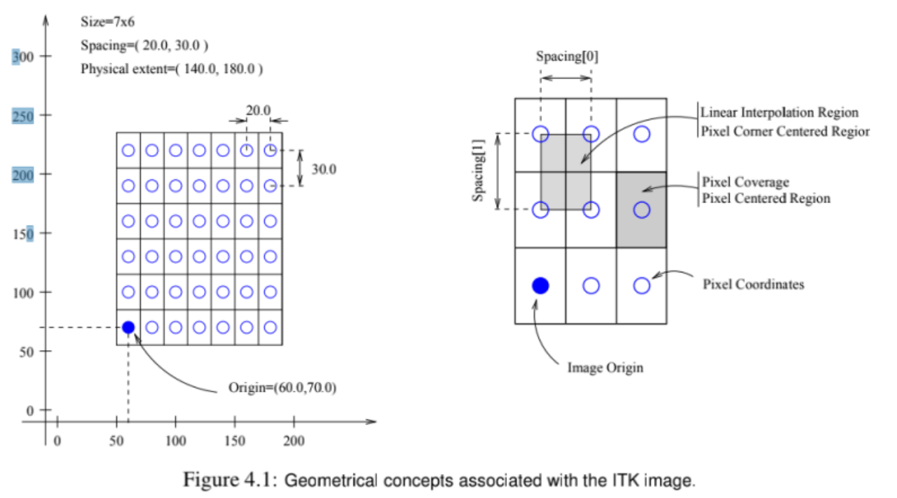

# ITK的基本数据结构

[TOC]

学习ITK之前，首先需要了解的就是ITK中的基本数据结构，即ITK中，数据是如何存储和表示的。

ITK中最基本的三种数据结构是：
itk::Image：体素矩阵存储的图像；
itk::Mesh：mesh数据，包含顶点point和cell，cell类型有多种，如常用的三角面片triangle face。
itk::PointSet：点集。

下面对这三种数据结构的创建和访问方式进行讲解。

## itk::Image

图像类型，即以像素为单位的体数据。可以理解为矩阵（2维和三维）。

图像是一种离散的表达形式，从物理世界的物体到图像，存在一个采样的过程。

因此这里存在一个采样网格，并通过采样网格，通过插值算法，生成图像。



采样网格存在一些属性：
- 网格的间隔：Size
- 网格的尺寸：Spacing
- 网格在物理坐标系下的方向：Direction
- 网格原点在物理坐标系的坐标：Origin

有了以上四个参数，可以在屋里空间唯一定义一个网格，因此也就能采样出一个唯一的图像。

这就是图像最重要的四个属性。本质上就是定义的图像的采样方式。

## itk::PointSet

点集类型。点集即点的结合。

每一个点又1x3的向量表示，记录的物理坐标系中x,y,z三个坐标轴的坐标值。

点集由多个点即成。如果有N个点，则点集可表示为Nx3的矩阵。

### pointset的创建

```cpp
//别名声明一个针对特定数据类型和维度的point set类型
using PointSetType = itk::PointSet<unsigned short, 3>;
//实例化一个对象，需要用一个智能指针接受
PointSetType::Pointer pointsSet = PointSetType::New();

//声明一个点的类型，这个类型不是直接用itk::Point<>定义，而是通过PointSetType获取，确保生命的PointType中的特性和当前的PointSetType保持一致
using PointType = PointSetType::PointType;

//创建点，按照下面p0的方式再创建p1,p2
PointType p0;
p0[0]=-1;p0[1]=-1;p0[2]=0;

//point set中添加点：
pointsSet->SetPoint(0,p0);
pointsSet->SetPoint(1,p1);
pointsSet->SetPoint(2,p2);
```
### pointset中点的访问

最常用的方式是使用容器和迭代器进行点的访问。
使用的类为PointsContainer。
对于动态的point set，PointsContainer底层是基于itk::MapContainer(封装的std::map);
对于静态的point set，PointsContainer底层是基于itk::VectorContainer(封装的std::vector);

#### 通过容器添加点到pointset
```cpp
using PointsContainer = PointSetType::PointsContainer;
PointsContainer::Pointer points = PointsContainer::New();
using PointType = PointSetType::PointType;
PointType p0,p1;
p0[0]=-1;p0[1]=0;p0[2]=0;
p1[0]=1;p1[1]=0;p1[2]=0;

//将点插入到容器中
unsigned int pointID=0;
points->InsertElement(pointID++, p0);
points->InsertElement(pointID++, p1);

//将容器中的点添加到point set
pointSet->SetPoints(points);
```

#### 通过容器访问pointset中的点

```cpp
//pointset中点读取到容器中
PointsContainer::Pointer points2 = pointSet->GetPoints();
//声明一个迭代器
using PointsIterator = PointsContainer::Iterator;

PointsIterator tmp = points2->Begin();//迭代的指针
PointsIterator end = points2->End();//迭代的截止条件
while(tmp!=end){
    PointType p = tmp.Value();//获取当前迭代到的点的值
    std::cout << p << std::endl;
    ++tmp;//向下一个指针遍历
}
```

### 采用不同的pixel type定义点和点云

点云上的每一个点出了具有坐标属性，它还能被赋予一个pixel值。它可以通过SetPointData/GetPointData进行设置或访问。

前面点云的pixel type通常为一个标量。但在itk中，同样允许将点云的pixel type定义为其他更复杂的类型。比如RBG值，可以表示点云的颜色；再比如vector，可以表示如点云上点的法向量（3维vector）等。

#### 使用RBG像素值定义point

```cpp
using PixelType=itk::RGBPixel<float>;
```

#### 使用向量定义point

```cpp
using PixelType=itk::Vector<float, 3>;
```

## itk::Mesh

用于在空间中表示形状。继承自itk::PointSet。
我们可以通过以下方式初始化一个mesh实例：
```cpp
//使用using指定别名，简化MeshType的写法
using PixelType = float;
constexpr unsigned int Dimension = 3;
using MeshType = itk::Mesh<PixelType, Dimension>;

//实例化mesh对象，实例化后返回mesh的指针并用智能指针封装
MeshType::Pointer mesh = MeshType::New();
```
### mesh顶点的添加和访问（迭代器）
```cpp
//为mesh添加点，点的类型为MeshType::PointType
MeshType::PointType p;
p[0]=0;
p[1]=1;
p[2]=-1;
mesh->SetPoint(0,p);
```
在mesh上遍历点，最方便的方式是使用迭代器iterator。
mesh上进行点遍历的迭代器类型为：
```cpp
//迭代器类型设置别名
using PointIterator = MeshType::PointsContainer::Iterator
//设置迭代器的开始位置和截止位置，即mesh的第一个点和最后一个点
PointsIterator tmp = mesh->GetPoints()->Begin();//mesh->GetPoints()函数实际上是返回了一个容器
PointsIterator end = mesh->GetPoints()->End();
//迭代获取mesh上的所有点
while(tmp!=end){
    MeshType::PointType p=tmp.Value();//点取值
    ++tmp;//迭代器步进，指向下一个点
}
```
### mesh上cell的添加和访问

mesh可以添加多种类型的cell：
- itk::LineCell线结构
- itk::TriangleCell：三角面片结构
- itk::QuadrilateralCell：四边形结构
- itk::TetrahedronCell：四面体结构
- itk::PolyonCell：多边形结构

不同的cell对应不同类型的mesh，最常用的是三角面片类型mesh。
以LineCell为例说明下如何给mesh添加cell：
```cpp
using CellType = MeshType::CellType;
using LineType = itk::LineCell<CellType>;//用在mesh的type，具有mesh中cell特性的cell

//cell使用auto pointer，而非默认的smart pointer。
//cell之所以使用auto pointer是因为对对于mesh上cell的管理，我们需要清楚明确哪一个指针对cell的内存直接负责。只有那一个指针负责这块内存的新建和释放。auto pointer具有这种特性。
using CellAutoPointer = CellType::CellAutoPointer;

//添加cell
MeshType::Pointer mesh = MeshType::New();//新建一个mesh

//新建顶点并为顶点坐标赋值
MeshType::PointType p0;
MeshType::PointType p1;
MeshType::PointType p2;
p0[0]=1.0;
...
p2[3]=-1.0;

//mesh添加顶点
mesh->SetPoint(0, p0);
mesh->SetPoint(1, p1);
mesh->SetPoint(2, p2);

//新建cell并实例化line对象
CellAutoPointer line0;
CellAutoPointer line1;
line0.TakeOwnership(new LineType);//将line0作为实例化LineType对象的主指针
line1.TakeOwnership(new LineType);

//为line添加point
line0->SetPointId(0,0);//第一个端点设置为id为0的点
line0->SetPointId(1,1);//第二个端点设置为id为1的点

line1->SetPointId(0,1);
line2->SetpointId(1,2);

//为mesh添加line
mesh->SetCell(0,line0);
mesh->SetCell(1,line1);
```

同样，需要遍历cell，也可以用迭代器:
```cpp
using CellIterator = MeshType::CellsContainer::Iterator;
```
使用方法和point的遍历一致。

### mesh的自定义设置

mesh其实有很多不同的类型（或成为特性），比如它支持不同的数据类型的顶点坐标、不同维度的顶点、不同维度的cell等等。

通过泛型编程，我们可以非常灵活通过同一个类itk::Mesh，定义具有不同特性的mesh。

可设置的mesh特性（traits）有以下：
- PixelType：点的坐标的数据类型，float or double...
- PointDimension：点的维度，二维 or 三维；
- MaxTopologicalDimension：cell的最高维度
- CoordRepType：用来表示空间坐标的数据类型
- InterpolationWeightType：插值权重数据类型
- CellPixelType：cell的数据类型

根据上文我们直接通过itk::Mesh<PixelType, PointDimension>实例化的mesh，其实只设置了mesh中点坐标的数据类型和点的维度，其他的特性其实采用的是默认设置。

下面的实例将描述如何通过泛型编程对所有特性进行设置，而这些设置主要通过itk::DefaultStaticMeshTraits这个类型实现(mesh的特性设置静态类)。
```cpp
constexpr unsigned int PointDimension=3;
constexpr unsigned int MaxTopologicalDimension=2;
using PixelType = itk::Vector<double, 4>;
using CellDataType = itk::Matrix<double, 4,3>;
using CoordnateType = double;
using InterpolationWeightType = double;

//声明一种mesh的特性类，并使用using设置别名
using MeshTraits = itk::DefaultStaticMeshTraits<
PixelType, 
PointDemension,
MaxTopologicalMimension, 
CoordinateType, 
InterpolationWeightType, 
CellDataType>
//声明一种mesh，使用前面声明的特性类型 
using MeshType = itk::Mesh<PixelType, PointDimension, MeshTraits>;
```
我们定义了一种自定义特性的mesh（点维度维3d，cell最大维度维2d，pixel、cell、坐标和插值权重数据类型均为double）。然后就可以利用这种特定的类型，去实例化mesh对象，然后进行添加点、cell等一系列的操作。这些操作和使用默认类型的mesh完全一致。

### 简化的mesh创建方式

itk::Mesh是一个非常通用和和灵活的类，这也导致了mesh的创建过程比较繁琐。

我们可以通过itk::AutomaticTopologyMeshSource类，简化mesh的创建。这个类可以根据你添加的cells，自动的生成K-complex的mesh。

```cpp
using PixelType = float;
using MeshType = itk::Mesh<PixelType, 3>;

//声明一个自动拓扑的mesh源类型，基于前面定义的MeshType
using MeshSourceType = itk::AutomaticTopologyMeshSource<MeshType>;

//实例化一个mesh source对象
MeshSourceType::Pointer meshSource;
meshSource = MeshSourceType::New();

//对mesh source对象添加四面体结构的简易方式：
meshSource->AddTetrahedron(
    meshSource->AddPoint(-1,-1,-1),
    meshSource->AddPoint(1,1,-1),
    meshSource->AddPoint(1,-1,1),
    meshSource->AddPoint(-1,1,1));
```
前面的介绍经过了复杂的流程，创建点，mesh添加点，点添加到四面体cell，mesh添加四面体cell；此处可以一句话搞定。
同样可以通过这种方式添加Triangle Faces（三角面片），使用AddTriangle()即可，不过只需要三个点。

这种方式虽然简便，但存在硬伤。当我们会在多个高维cell中用到相同的点时，上面的方式会出问题，因为mesh会对同一个点进行多次AddPoint操作。因此有另一种方式。

```cpp
//IdentifierType：cell在mesh中的id
//IdentifierArrayType：IdentifierType的数组
using IdentifierArrayType = MeshSourceType::IdentifierArrayType;

//创建一个数组存储新添加的point cell在mesh中的id
IdentifierArrayType idArray(4);

//创建一个点并添加到mesh，同时记录他的cell id
using PointType = MeshType::PointType;
PointType p;
p[0] = -2;p[1] = -2;p[2] = -2;
idArray[0] = meshSource->AddPoint(p);//添加第1个点

p[0] = 2;p[1] = 2;p[2] = -2;
idArray[1] = meshSource->AddPoint(p);//添加第2个点

p[0] = 2;p[1] = -2;p[2] = 2;
idArray[1] = meshSource->AddPoint(p);//添加第3个点
p[0] = -2;p[1] = 2;p[2] = 2;
idArray[1] = meshSource->AddPoint(p);//添加第4个点

//现在可以根据点的cell id添加高维cell，如三角面片：
meshSource->AddTriangle(idArray[0] ,idArray[1], idArray[2]);
meshSource->AddTriangle(idArray[1] ,idArray[2], idArray[3]);
meshSource->AddTriangle(idArray[2] ,idArray[3], idArray[0]);
meshSource->AddTriangle(idArray[3] ,idArray[0], idArray[1]);
```
这种方式创建方式更加灵活实用。也是最常采用的形式。


