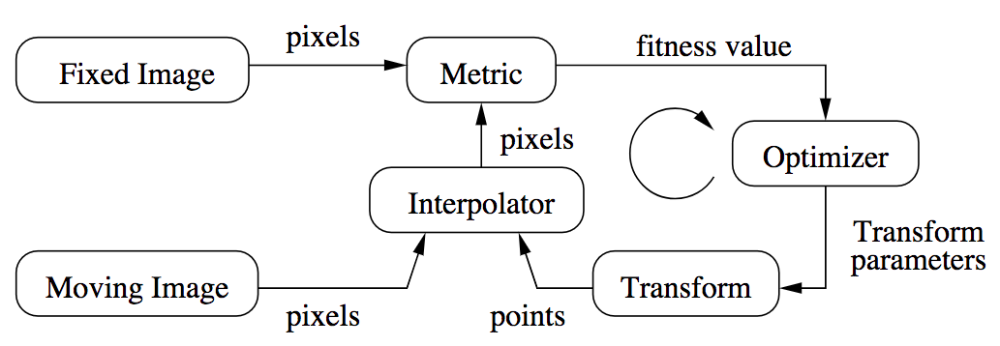
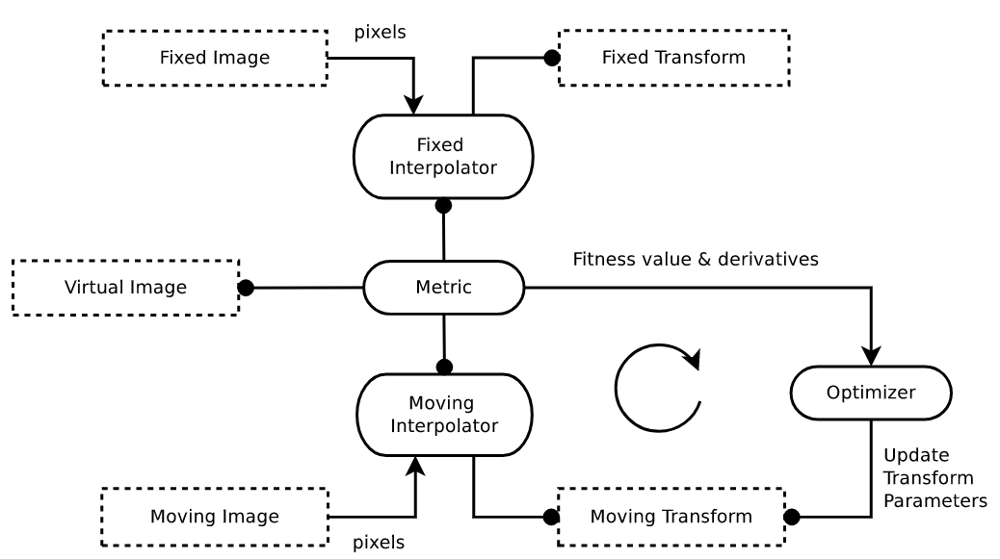

# ITK的配准框架

## 传统配准框架和ITKv4配准框架
图像配准：找到一个空间变换映射，从一个图像映射到另一个图像。

下图为图像典型的图像配准框架的基本组成：

传统的图像配准流程中，我们将moving图像朝fixed图像的图像空间进行插值重采样后，计算两个图像的相似性测度（metric），然后调整变换参数对moving图像重新变换并差值。


figure-经典的图像配准框架基本组成

ITKv4的配准框架相比于传统的配准流程，提供了更多的灵活性。在这个新的框架中，配准的metric计算可以在一个物理空间中，这个物理空间和前面的fixed image的空间具有不同的采样密度。而是实际的计算空间被定义在了一个叫“virtual image”的图像空间中，而这个空间中可以定义任意的物理坐标点的连续空间，不是限制在采样网格上的离散点。

因此在ITKv4配准流程中，需要同时对fixed图像和moving图像都进行插值，到virtual图像空间，计算metric，然后调整moving图像的tranform进行下一次插值和计算。


figure-ITKv4的图像配准框架的基本组成

## registration “helloworld”示例

以下示例简单展示如何在ITK中使用图像配准框架。

一个图像配准方法包含一下组件：
- 两张输入图像(itk::image)；
- 一个变换(itk::)
- 一个测度（metric）
- 一个优化器

### 应用需要的头文件
```cpp
#include "itkImageRegistrationMethodv4.h"//配准方法头文件
#include "itkTranslationTransform.h"//平移变换头文件
#include "itkMeanSquaresImageToImageMetricv4.h"//均方差测度头文件
#include "itkRegularStepGradientDsecentOptimizerv4.h"//常规梯度下降优化器头文件
```
### 创建配准中的重要组件并设置配准类型

```cpp
constexpr unsigned int Dim = 2;
using PixelType = float;
//声明输入图像的类型
using FixedImageType = itk::Image<PixelType, Dim>;
using MovingImageType = itk::Image<PixelType, Dim>;
//声明变换、测度和优化器的类型
using TransformType = itk::itkTranslationTransform<double, Dim>;
using OptimizerType = itk::itkRegularStepGradientDsecentOptimizerv4<double>;
using MetricType = itkMeanSquaresImageToImageMetricv4<FixedImageType, MovingImageType>;
//声明所使用的配准方法，需要设定好输入图像类型和变换类型
using RegistrationType = itk::itkImageRegistrationMethodv4<FixedImageType, MovingImageType, TransformType>;

//对所有涉及的类进行实例化
MetricType::Pointer metric = MetricType::New();
OptimizerType::Pointer optimizer = OptimizerType::New();
RegistrationType::Pointer reg = RegistrationType::New();
//对配准框架设定相似性测度和优化器
reg->SetMetric(metric);
reg->SetOptimizer(optimizer);
```

这个示例中，我们不需要创建一个transform的实例并传递给registration实例，因为registration filter会根据前面声明的时候传递给registration的transform类型，自动在内部创建transform的实例

### 为metric设置插值函数

计算metric需要对图像插值到virtual image空间，因此我们还需要创建插值实例，传递给metric

```cpp
//声明
using FixedLinearInterpolatorType = itk::LinearInterpolatorImageFunction<FixedImageType, double>;
using MovingLinearInterpolatorType = itk::LinearInterpolatorImageFunction<MovingImageType, double>;
//实例化
FixedLinearInterpolatorType::Pointer fixedInterp = FixedLinearInterpolatorType::New();
MovingLinearInterpolatorType::Pointer movingInterp = MovingLinearInterpolatorType::New();
//设置
metric->SetFixedInterpolator(fixedInterp);
metric->SetMovingInterpolator(movingInterp);
```

### fixed和moving图像的初始变换（to virtual图像空间）

virtual图像空间是ITKv4的一个新的概念，它使得我们可以使配准过程在一个物理空间中进行，这个空间有别于fixed图像空间或moving图像空间。我们在virtual图形空间计算相似性测度。

ITKv4配准框架允许为fixed图像和moving图像分别设置初始变换，应用初始变换后变换到virtual图像空间。

```cpp
//为moving image设置初始变换(平移)
TransformType::Poniter movingInitT = TransformType::New();

TransformType::ParametersType initParam(movingInitT->GetNumberOfParameters());
initParam[0] = 0;
initParam[1] = 0;

movingInitT->SetParameters(initParam);
reg->SetMovingInitialTransform(movingInitT);

//维fixed image设置初始变换（单位矩阵，相当于无变换）
TransformType::Pointer identityT = TransformType::New();
identityT->SetIdentity();

reg->SetFixedInitialTransform(identityT);
```

### 设置优化器参数

