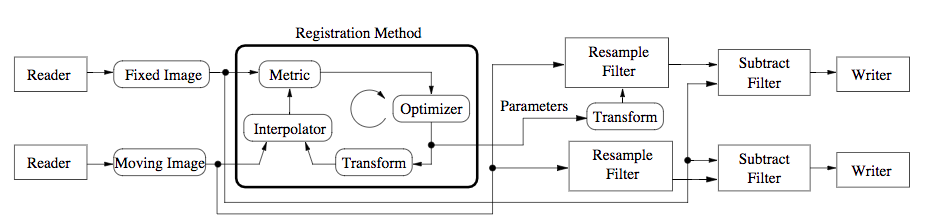

[TOC]

# ITK的配准框架

## 传统配准框架和ITKv4配准框架
图像配准：找到一个空间变换映射，从一个图像映射到另一个图像。

下图为图像典型的图像配准框架的基本组成：

传统的图像配准流程中，我们将moving图像朝fixed图像的图像空间进行插值重采样后，计算两个图像的相似性测度（metric），然后调整变换参数对moving图像重新变换并差值。


figure-经典的图像配准框架基本组成

ITKv4的配准框架相比于传统的配准流程，提供了更多的灵活性。在这个新的框架中，配准的metric计算可以在一个物理空间中，这个物理空间和前面的fixed image的空间具有不同的采样密度。而是实际的计算空间被定义在了一个叫“virtual image”的图像空间中，而这个空间中可以定义任意的物理坐标点的连续空间，不是限制在采样网格上的离散点。

因此在ITKv4配准流程中，需要同时对fixed图像和moving图像都进行插值，到virtual图像空间，计算metric，然后调整moving图像的tranform进行下一次插值和计算。


figure-ITKv4的图像配准框架的基本组成

## registration “helloworld”示例

以下示例简单展示如何在ITK中使用图像配准框架。

一个图像配准方法包含一下组件：
- 两张输入图像(itk::image)；
- 一个变换(itk::)
- 一个测度（metric）
- 一个优化器

### 引用必要的头文件
```cpp
#include "itkImageRegistrationMethodv4.h"//配准方法头文件
#include "itkTranslationTransform.h"//平移变换头文件
#include "itkMeanSquaresImageToImageMetricv4.h"//均方差测度头文件
#include "itkRegularStepGradientDsecentOptimizerv4.h"//常规梯度下降优化器头文件
```
### 创建配准中的重要组件并设置配准类型

```cpp
constexpr unsigned int Dim = 2;
using PixelType = float;
//声明输入图像的类型
using FixedImageType = itk::Image<PixelType, Dim>;
using MovingImageType = itk::Image<PixelType, Dim>;
//声明变换、测度和优化器的类型
using TransformType = itk::itkTranslationTransform<double, Dim>;
using OptimizerType = itk::itkRegularStepGradientDsecentOptimizerv4<double>;
using MetricType = itkMeanSquaresImageToImageMetricv4<FixedImageType, MovingImageType>;
//声明所使用的配准方法，需要设定好输入图像类型和变换类型
using RegistrationType = itk::itkImageRegistrationMethodv4<FixedImageType, MovingImageType, TransformType>;

//对所有涉及的类进行实例化
MetricType::Pointer metric = MetricType::New();
OptimizerType::Pointer optimizer = OptimizerType::New();
RegistrationType::Pointer reg = RegistrationType::New();
//对配准框架设定相似性测度和优化器
reg->SetMetric(metric);
reg->SetOptimizer(optimizer);
```

这个示例中，我们不需要创建一个transform的实例并传递给registration实例，因为registration filter会根据前面声明的时候传递给registration的transform类型，自动在内部创建transform的实例

### 为metric设置插值函数

计算metric需要对图像插值到virtual image空间，因此我们还需要创建插值实例，传递给metric

```cpp
//声明
using FixedLinearInterpolatorType = itk::LinearInterpolatorImageFunction<FixedImageType, double>;
using MovingLinearInterpolatorType = itk::LinearInterpolatorImageFunction<MovingImageType, double>;
//实例化
FixedLinearInterpolatorType::Pointer fixedInterp = FixedLinearInterpolatorType::New();
MovingLinearInterpolatorType::Pointer movingInterp = MovingLinearInterpolatorType::New();
//设置
metric->SetFixedInterpolator(fixedInterp);
metric->SetMovingInterpolator(movingInterp);
```

### fixed和moving图像的初始变换（to virtual图像空间）

virtual图像空间是ITKv4的一个新的概念，它使得我们可以使配准过程在一个物理空间中进行，这个空间有别于fixed图像空间或moving图像空间。我们在virtual图形空间计算相似性测度。

ITKv4配准框架允许为fixed图像和moving图像分别设置初始变换，应用初始变换后变换到virtual图像空间。

```cpp
//为moving image设置初始变换(平移)
TransformType::Poniter movingInitT = TransformType::New();

TransformType::ParametersType initParam(movingInitT->GetNumberOfParameters());
initParam[0] = 0;
initParam[1] = 0;

movingInitT->SetParameters(initParam);
reg->SetMovingInitialTransform(movingInitT);

//维fixed image设置初始变换（单位矩阵，相当于无变换）
TransformType::Pointer identityT = TransformType::New();
identityT->SetIdentity();

reg->SetFixedInitialTransform(identityT);
```

### 设置优化器参数

优化器会驱动配准的执行过程，是配准算法的动力源。

优化器通过对测度计算进行求导，通过求导将参数的更新反向传播给各个参数，用于参数的更新。

本示例中使用的梯度下降求导法。这里面需要设置以下参数：
- SetLearningRate：学习率，即每次梯度下降的步长；
- SetRelaxationFactor：学习率如果一只采用一个较大的值，则可能错过极值点，因此需要一个relaxation factor逐步减小步长。
- SetMinimumStepLength：设置一个最小的步长限制，防止补偿无限制减小
- SetNumberOfIterations：设置迭代次数

```cpp

optimizer->SetLearningRate(4);
optimizer->SetMinimumStepLength(0.001);
optimizer->SetRelaxationFactor(0.5);
optimizer->SetNumberOfIterations(200);
```

### ITKv4的多尺度框架的支持和设置

ITKv4配准框架支持多尺度配准，不同尺度下可以设置：
1. virtual图像空间的不同分辨率；
2. fixed图像和moving图像在virtual空间下的不同平滑度。

本示例中只简单的设置但尺度下分辨率和平滑度的设置。

```cpp
//尺度数量设置
constexpr unsigned int numberOfLevels = 1;
//分辨率缩小比率
RegistrationType::ShrinkFactorsArrayType shrinkFactorsPerLevel;
shrinkFactorsPerLevel.SetSize(1);
shrinkFactorsPerLevel[0]=1;
//平滑度
RegistrationType::SmoothingSigmasArrayType smoothingSigmasPerLevel;
smoothingSigmasPerLevel.SetSize(1);
smoothingSigmasPerLevel[0]=0;

reg->SetNumberOfLevels(numberOfLevels);
reg->SetSmoothingSigmaPerLevel(smoothingSigmasPerLevel);
reg->SetShrinkFactorsPerLevel(shrinkFactorsPerLevel);
```

### 执行配准&获取结果

配准的执行通过update函数触发，并通过try/catch捕获其中可能出现的异常。

```cpp
//执行配准
try{
    reg->Update();
    std::cout<<"optimizer stop condition:"<<reg->GetOptimizer()->GetStopConditionDescription()<<std::endl;
}
catch(const itk::ExceptionObject & err){
    std::cerr<<"ExceptionObject caught!"<<std::endl;
    std::cerr<<err<<std::endl;
}
//获取结果(translation transform)
TransformType::ConstPointer transform = reg->GetTransform();
TransformType::ParameterType finalParams = transform->GetParameters();
const double TranslationX = finalParams[0];
const double TranslationY = finalParams[1];

//获取实际执行的迭代次数
const unsigned int numberOfIterations = optimizer->GetCurrentIteration();

//获取最终计算得到的最佳测度值
const double bestvalue = optimizer->GetValue();
```

### 获取moving到fixed的最终变换

配准执行完后，可以得到在virtual空间中moving图像到fixed图像的变换矩阵。但这个实际上不是最终的moving到fixed的变换矩阵。因为还存在fixed到virtual，moving到virtual的初始变换也要考虑进去。

本示例中，fixed到virtual的初始变换是单位矩阵，相当于等同映射。而moving到virtual是存在一个初始变换的。因此需要考虑。所以：

T(moving2fix) = T(moving2virtual)+T(virtual2fixed)

这里的加号不是数值上的加，而是两个变换的组合，本质上其实是矩阵的相乘。itk提供一下方式实现：
```cpp
using CompositeTransformType = itk::CompositeTransform<double, Dim>;
CompositeTransformType::Poniter outputCompositeT = CompositeTransformType::New();
outputCompositeT->AddTransform(movingInitT);//添加moving图像的初始变换
outputCompositeT->AddTransform(reg->getModiableTransform());//添加配准得到的变换矩阵
```

### moving图像的重采样和结果保存

得到moving到fixed的变换矩阵之后，后一步就是进行resample，将moving 图像重采样到fixed图像空间：
```cpp
using ResampleFilterType = ikt::ResampleImageFilter<MovingImageType, FixedImageType>;

ResampleFilterType::Pointer resampler = ResampleFilterType::New();

//对resampler filter进行设置
resampler->SetInput(movingImageReader->GetOutput());
resampler->SetTransform(outputCompositeT);
FixedImageType::Pointer fixedImg = fixedImageReader->GetOutput();
resampler->SetSize(fixedImg->GetLargestPossibleRegion().GetSize());
resampler->SetOutputSpacing(fixedImg->GetSpacing());
resampler->SetOutputOrigin(fixedImg->GetOrigin());
resampler->SetOutputDirection(fixedImg->GetDirection());
resampler->SetDefaultPixelValue(100);
```

resampler的结果，可以通过resampler->GetOuput()获得。本例中，我们需要把moving 图像直接保存下来，因此后续继续使用itk::CastImageFilter对图像类型进行转换并利用itk::ImageWriter直接保存到磁盘中，如下：

```cpp
using OutputPixelType = unsigned char;
using OutputImageType = itk::Image<OutputPixelType, Dim>;
//声明一个图像类型转换fliter
using CastFilterType = itk::CastImageFilter<FixedImageType, OutputPixelType>;
//声明一个图像保存filter
using WriterType = itk::ImageFileWriter<OutputImageType>;
//实例化
CastFilterType::Pointer caster = CastFilterType::New();
WriterType::Pointer writer = WriterType::New();
//设置并执行
caster->SetInput(resampler->GetOuput());
writer->SetInput(caster->GetOutput());
writer->Update();//只需要对filter管道中的最后一个filter执行update，前面的filter均会自动触发。
```

### 查看配准效果：图像剪影

一种方便的查看两个图像配准效果（同模态）的方法，就是配准后的moving和fixed图像做剪影操作，使用itk::SubtractImageFilter，如下：

```cpp
using DifffFilterType = itk::SubtractImageFilter<FixedImageType, FixedImageType, FixedImageType>;

DifffFilterType::Poniter diff = DifffFilterType::New();

diff->SetInput1(fixedImageReader->GetOutput());
diff->SetIput2(resampler->GetOutput());
```

剪影后的图像可能因为两幅图像本身差异非常小，剪影的结果的像素值很小，为了让剪影图像能够比较好的进行观察，可以对图像的灰度进行拉伸，可使用itk::RescaleIntensityImageFilter函数。
```cpp
using RescalerType = itk::RescaleIntensityImageFilter<FixedImageType, OutputImageType>;

RescalerType::Pointer intensityRescaler = RescalerType::New();

intensityRescaler->Setinput(diff->GetOutput());
intensityRescaler->SetOutputMinimum(0);
intensityRescaler->SetOutputMaximum(255);

resampler->SetDefaultPixelValue(1);//调整前面设置的resampler的补的值维1，避免对补的值太大导致剪影图像结果动态范围受到影响

//使用一个新的writer保存灰度变换之后的结果
WriterType::Pointer writer2 = WriterType::New();
writer2->SetInput(intensityRescaler->GetOuput());
```

### 流程总结

至此，整个配准流程，从图像的导入，到配准，再到变换重采样，再保存，就完成了。下面这个框图表示了整个处理流程。


figure-本示例的配准整体流程示意图

