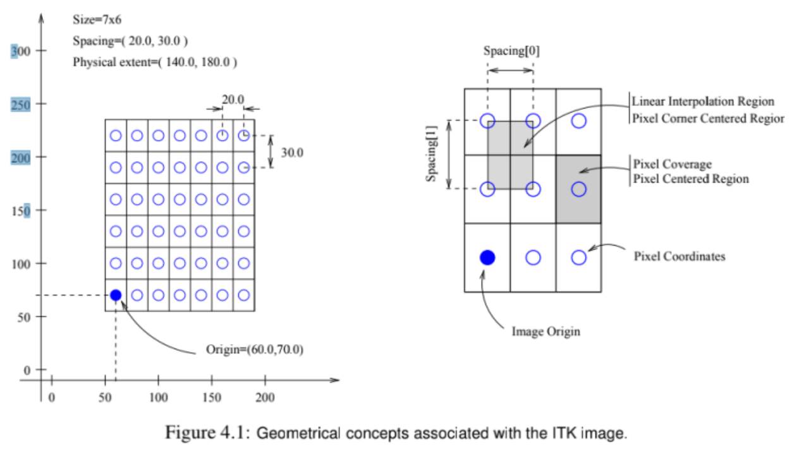

# ITK的基本数据结构

[TOC]

itk::Image
itk::Mesh
itk::PointSet

## itk::Image

图像类型，即以像素为单位的体数据。可以理解为矩阵（2维和三维）。

图像是一种离散的表达形式，从物理世界的物体到图像，存在一个采样的过程。

因此这里存在一个采样网格，并通过采样网格，通过插值算法，生成图像。



采样网格存在一些属性：
- 网格的间隔：Size
- 网格的尺寸：Spacing
- 网格在物理坐标系下的方向：Direction
- 网格原点在物理坐标系的坐标：Origin

有了以上四个参数，可以在屋里空间唯一定义一个网格，因此也就能采样出一个唯一的图像。

这就是图像最重要的四个属性。本质上就是定义的图像的采样方式。

## itk::PointSet

点集类型。点集即点的结合。

每一个点又1x3的向量表示，记录的物理坐标系中x,y,z三个坐标轴的坐标值。

点集由多个点即成。如果有N个点，则点集可表示为Nx3的矩阵。

```cpp
itk:
```


## itk::Mesh

用于在空间中表示形状。继承自itk::PointSet。
我们可以通过以下方式初始化一个mesh实例：
```cpp
//使用using指定别名，简化MeshType的写法
using PixelType = float;
constexpr unsigned int Dimension = 3;
using MeshType = itk::Mesh<PixelType, Dimension>;

//实例化mesh对象，实例化后返回mesh的指针并用智能指针封装
MeshType::Pointer mesh = MeshType::New();
```
### mesh顶点的添加和访问（迭代器）
```cpp
//为mesh添加点，点的类型为MeshType::PointType
MeshType::PointType p;
p[0]=0;
p[1]=1;
p[2]=-1;
mesh->SetPoint(0,p);
```
在mesh上遍历点，最方便的方式是使用迭代器iterator。
mesh上进行点遍历的迭代器类型为：
```cpp
//迭代器类型设置别名
using PointIterator = MeshType::PointsContainer::Iterator
//设置迭代器的开始位置和截止位置，即mesh的第一个点和最后一个点
PointsIterator tmp = mesh->GetPoints()->Begin();
PointsIterator end = mesh->GetPoints()->End();
//迭代获取mesh上的所有点
while(tmp!=end){
    MeshType::PointType p=tmp.Value();//点取值
    ++tmp;//迭代器步进，指向下一个点
}
```
### mesh上cell的添加和访问

mesh可以添加多种类型的cell：
- itk::LineCell线结构
- itk::TriangleCell：三角面片结构
- itk::QuadrilateralCell：四边形结构
- itk::TetrahedronCell：四面体结构
- itk::PolyonCell：多边形结构

不同的cell对应不同类型的mesh，最常用的是三角面片类型mesh。
以LineCell为例说明下如何给mesh添加cell：
```cpp
using CellType = MeshType::CellType;
using LineType = itk::LineCell<CellType>;//用在mesh的type，具有mesh中cell特性的cell

//cell使用auto pointer，而非默认的smart pointer。
//cell之所以使用auto pointer是因为对对于mesh上cell的管理，我们需要清楚明确哪一个指针对cell的内存直接负责。只有那一个指针负责这块内存的新建和释放。auto pointer具有这种特性。
using CellAutoPointer = CellType::CellAutoPointer;

//添加cell
MeshType::Pointer mesh = MeshType::New();//新建一个mesh

//新建顶点并为顶点坐标赋值
MeshType::PointType p0;
MeshType::PointType p1;
MeshType::PointType p2;
p0[0]=1.0;
...
p2[3]=-1.0;

//mesh添加顶点
mesh->SetPoint(0, p0);
mesh->SetPoint(1, p1);
mesh->SetPoint(2, p2);

//新建cell并实例化line对象
CellAutoPointer line0;
CellAutoPointer line1;
line0.TakeOwnership(new LineType);//将line0作为实例化LineType对象的主指针
line1.TakeOwnership(new LineType);

//为line添加point
line0->SetPointId(0,0);//第一个端点设置为id为0的点
line0->SetPointId(1,1);//第二个端点设置为id为1的点

line1->SetPointId(0,1);
line2->SetpointId(1,2);

//为mesh添加line
mesh->SetCell(0,line0);
mesh->SetCell(1,line1);
```

同样，需要遍历cell，也可以用迭代器:
```cpp
using CellIterator = MeshType::CellsContainer::Iterator;
```
使用方法和point的遍历一致。

### mesh的自定义设置

mesh其实有很多不同的类型（或成为特性），比如它支持不同的数据类型的顶点坐标、不同维度的顶点、不同维度的cell等等。

通过泛型编程，我们可以非常灵活通过同一个类itk::Mesh，定义具有不同特性的mesh。

可设置的mesh特性（traits）有以下：
- PixelType：点的坐标的数据类型，float or double...
- PointDimension：点的维度，二维 or 三维；
- MaxTopologicalDimension：cell的最高维度
- CoordRepType：用来表示空间坐标的数据类型
- InterpolationWeightType：插值权重数据类型
- CellPixelType：cell的数据类型

根据上文我们直接通过itk::Mesh<PixelType, PointDimension>实例化的mesh，其实只设置了mesh中点坐标的数据类型和点的维度，其他的特性其实采用的是默认设置。

下面的实例将描述如何通过泛型编程对所有特性进行设置，而这些设置主要通过itk::DefaultStaticMeshTraits这个类型实现(mesh的特性设置静态类)。
```cpp
constexpr unsigned int PointDimension=3;
constexpr unsigned int MaxTopologicalDimension=2;
using PixelType = itk::Vector<double, 4>;
using CellDataType = itk::Matrix<double, 4,3>;
using CoordnateType = double;
using InterpolationWeightType = double;

//声明一种mesh的特性类，并使用using设置别名
using MeshTraits = itk::DefaultStaticMeshTraits<
PixelType, 
PointDemension,
MaxTopologicalMimension, 
CoordinateType, 
InterpolationWeightType, 
CellDataType>
//声明一种mesh，使用前面声明的特性类型
using MeshType = itk::Mesh<PixelType, PointDimension, MeshTraits>;
```
我们定义了一种自定义特性的mesh（点维度维3d，cell最大维度维2d，pixel、cell、坐标和插值权重数据类型均为double）。然后就可以利用这种特定的类型，去实例化mesh对象，然后进行添加点、cell等一系列的操作。这些操作和使用默认类型的mesh完全一致。


