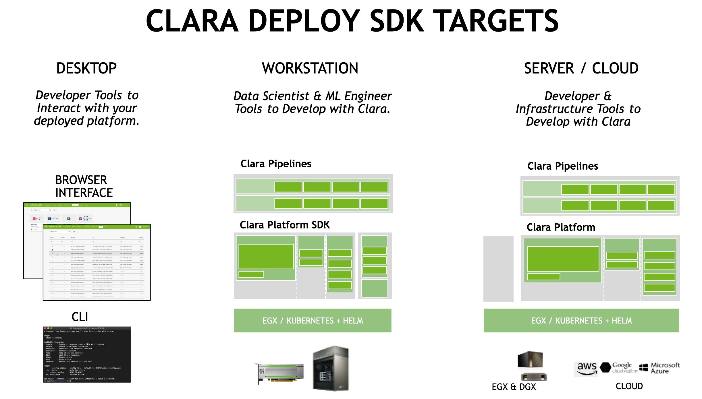
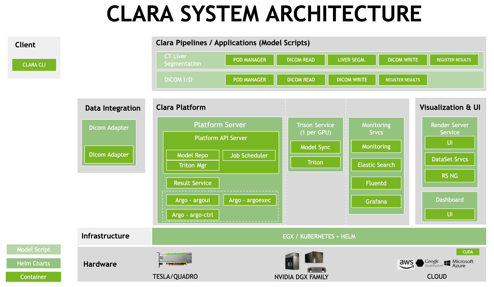

# 介绍

Clara Deploy SDK由一系列的container共同组成，共同形成一个端到端医学影像处理管道（pipelines）。整个生态系统能够运行在不同的云供应商或本地硬件（含pascal或更新的gpu）

## Clara Platform

clara平台是clara deploy sdk的核心部分，控制着clara的payloads，pipelines，jobs，results。扮演着数据流的仲裁者、路由器和管理者。通过提供api的方式实现。

平台的主要职责包括：

- 接收和执行pipelines，作为jobs；
- 部署pipeline容器，通过helm；
- clara系统状态的真实来源。

### Clara Platform API

Clara Platform 提供基于 GRPC 的接口，支持 Clara Deploy SDK 的第一方和第三方扩展。 DICOM 适配器、其他 PACS 接口或其他卫星系统等服务都通过 Clara 平台 API 与 Clara Deploy SDK 接口。 API 提供对有效负载、管道和作业状态的编程访问； 以及创建新管道、启动管道作业和与有效负载内容交互的能力。

例如：Clara CLI 是提供的用于从命令行与 Clara Deploy SDK 交互的实用程序，它依赖 Clara Platform API 来提供其大部分功能。 类似地，DICOM 适配器依赖 Clara 平台，在当DICOM数据发送给他时， 通过 API 来启动和监视管道作业。

## DICOM Adapter

DICOM Adapter 是医院 PACS 和 Clara Deploy SDK 之间的集成点。 在典型的 Clara Deploy SDK 部署中，它是 Clara 的第一个数据接口。 DICOM Adapter 提供接收 DICOM 数据、将数据放入有效负载以及触发管道的能力。 当管道产生结果时，DICOM 适配器将结果传送到 PACS。

## Results Service

跟踪所有管道生成的所有结果。 它在管道（pipelines）和将结果交付给外部设备的服务（services）之间架起了桥梁。

## Clara Pipeline

Clara 管道是一组容器组成，配置这些容器协同工作，以执行医学图像处理任务。 Clara 发布的API，允许将任何容器添加到 Clara Deploy SDK 中的管道。 这些容器是基于 nvidia-docker 的 Docker 容器，以及一些增强的应用程序支持 Clara Container 管道驱动程序。

使用管道定义语言，用户可以将多步骤的管道定义为一系列任务，并捕获任务之间的依赖关系。例如，管道可以依次连接以下操作：

- DICOM Reader Operator
- AI Inference Operator
- DICOM Writer Operator

在管道执行期间，Clara 平台引擎将协调将必要数据提供给管道中的特定operator。对于此特定示例，来自注册数据源的传入 DICOM 图像将可供 DICOM reader operator 使用。当 DICOM reader operator 完成其执行后，其输出将被馈送到 AI 推理 operator 。同样，AI 推理 operator 的输出将提供给 DICOM Writer operator。最后，可以将 DICOM Writer Operator 的输出推送到 PACS DICOM 存储服务。

Job是管道的实例。

### Service
## TensorRT Inference Server

Tensor RT 推理服务器是一种针对 NVIDIA GPU 优化的推理解决方案。 它通过 HTTP 或 gRPC 端点提供推理服务。

## Render Server

渲染服务提供医学影像的可视化。

## Clara I/O model

Clara I/O 模型旨在遵循可由 Kubernetes 执行和扩展的标准。 有效载荷（payloads）和结果（results）是分开的，以保留有效载荷以便在失败或中断时优先重新启动，以允许让输入可被多个管道重复使用。

- 有效负载（输入）显示为只读卷。
- 作业是在有效负载上管道的执行。
- 结果（输出、暂存空间）是读写卷，以一对一的关系与创建它们的作业配对。
- 数据集（可重用输入）是只读卷。
- 端口允许应用程序 I/O。
- 管道配置是 Helm 表。
- 运行时容器配置通过 YAML 文件设置。