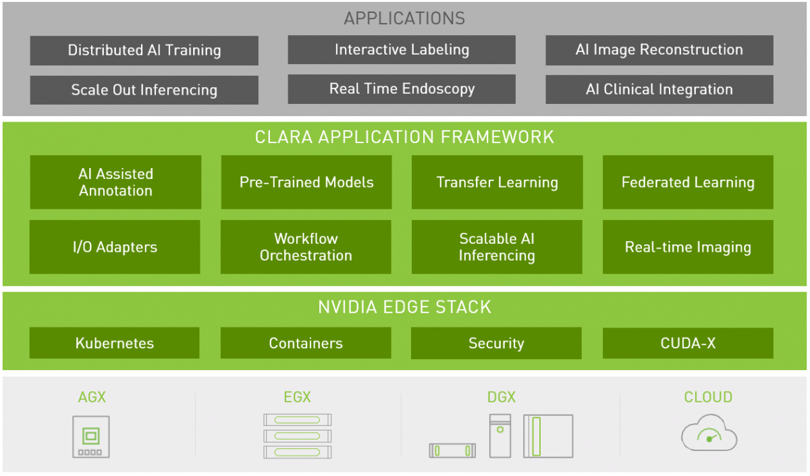

# MONAI(Medical Open Network for AI)

NVIDIA和伦敦国王学院于2019年推出的开源AI框架，基于PyTorch框架。

和PyTorch的用法完全一致，从PyTorch转到MONAI零成本。

医疗健康领域的pytorch。
数据科学家和临床医生之间的合作；
支持联邦学习；
MONAI已经成为医疗健康领域的首选深度学习框架；

## MONAI和NVIDIA Clara的关系

NVIDIA Clara是NVIDIA的一个适用于医疗健康行业的智能计算平台。凭借一个适用于医学影像、基因组学以及患者监控（智慧医院）的平台（可部署到任何地方，嵌入式、边缘、云），助理精准医疗。

医学影像方向的框架叫Clara Imaing。提供：
1. 数据标注加速；
2. 构建领域专用AI模型；
3. 提供预训练模型和参考应用程序部署智能影像工作流。

- Clara Train：
  - Clara Training Framework：MONAI
  - pre-trained model
  - AI-Assisted Annotation
  - AutoML
  - Federated Learning
  - 注：Clara4.0才开始把MONAI作为Clara的训练框架，之前是使用的基于TensorFlow的框架。
- Clara Deploy

提供用于训练和评估基于图像的深度学习模型的关键组件；

## MONAI Label：
一个智能的开源图像标记和学习工具，帮助研究人员和临床医生协作，创建代标注的数据集，以标准化的MONAI范式构建人工智能模型。

是一个开源的服务器客户机系统；
包含算法：DeepGrow DeepEidt 自动分割

3D Slicer插件
monai支持3d slicer的插件