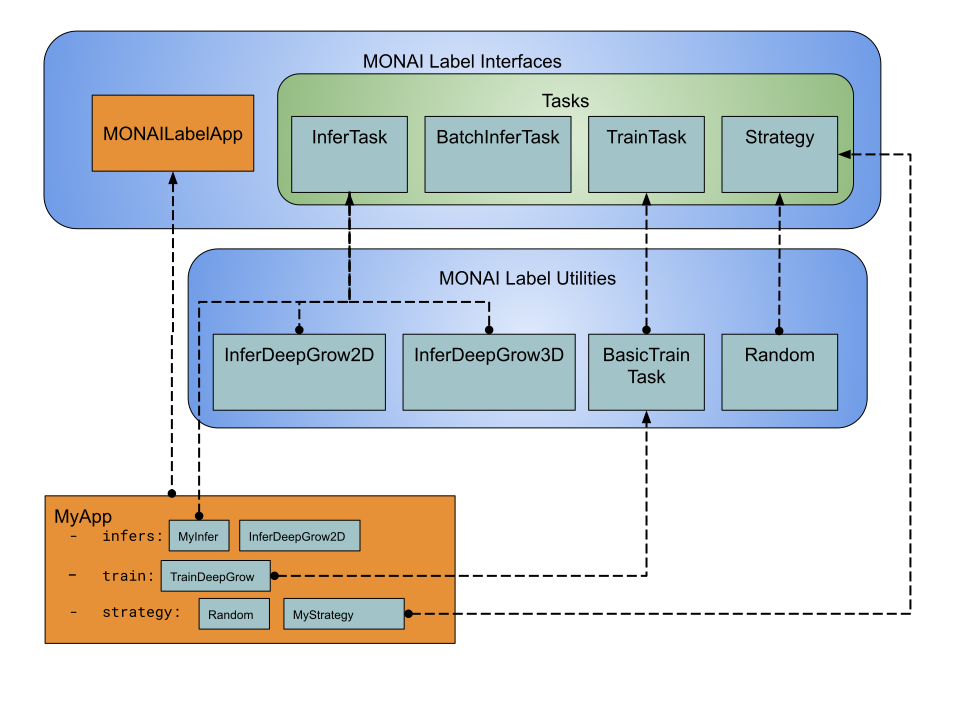

# MONAI Label

MONAI Label设计的目的是帮助研究者通过serverless的方式构建一个标注应用。即这个标注应用可以随时通过MONAI label服务器进行部署。

为开发这样一个monai标注app，开发者必须继承MONAILabelApp的接口并实现和具体任务相关的一些方法。

图1展示了monailabel所能提供的基本的接口，和如何用这些接口构建一个完整的monailabel app。

## MONAI Label的接口与函数库

### MONAILabelApp

一个app类，可以被继承创建一个monai label app，提供一个app需要的基础功能，同时提供了可供集成和重载的interfaces。

### MONAI Label Interfaces

monai label提供的基本接口，用于构建一个基本的app，通过继承这些接口，并进行一定程度的改写，可以将app制定为特定任务的形式。

包括以下四个基本接口：
- InferTask
- BatchInferTask
- TrainTask
- Strategy

### MONAI Label Utilities

monai label中提供的一些工具类，包括：
- InferDeepGrow2D
- InferDeepGrow3D
- BasicTrainTask
- Random

## 通过monai label创建app

一个完整的monai label app，通常包括以下几部分：

- 推理任务：允许终端用户选择与训练模型进行推理
- 训练任务：允许任务训练模型
- 策略：允许用户基于某些标准，选择下一张需要用于标注的影像

上图中我们创建了一个名叫MyApp的应用，它整体继承自MONAILabelApp类，并包含以下部分：

- 两个推理任务：
  - 基于InferTask构建的自定义MyInfer；
  - 由monai label直接提供的InferDeepGrow2D；
- 一个训练任务：TrainDeepGrow,是BasicTrainTask的扩展；
- 两个图像选择策略：
  - 完全随机
  - 一个自定义的MyStrategy类