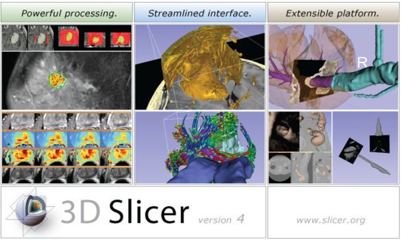
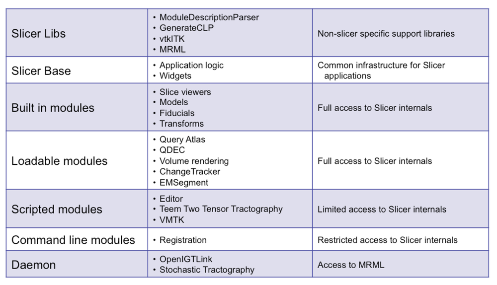
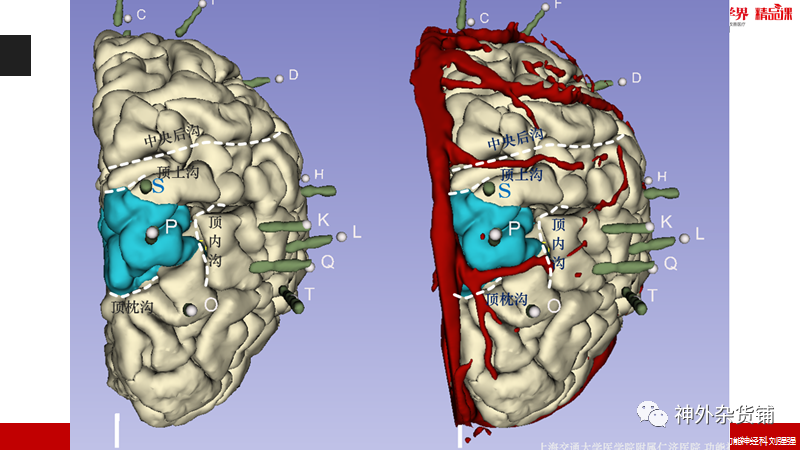
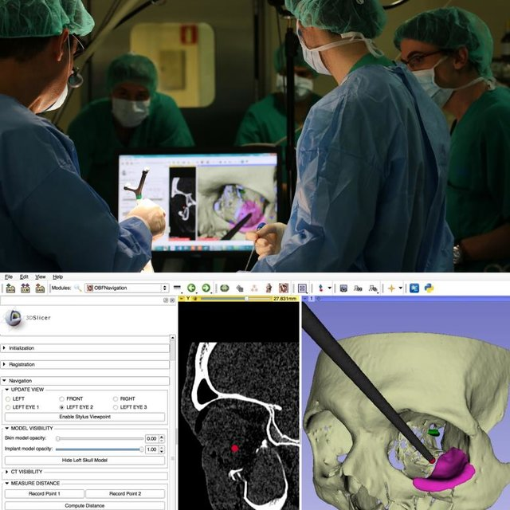
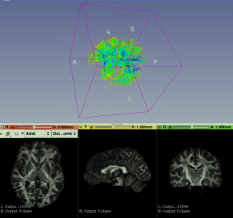

# 使用3DSlicer进行医学影像分析

今天聊聊3D Slicer，我比较喜欢的一个开源医学影像分析和可视化平台。
它的底层基于ITK、VTK和CTK，界面基于QT，都是优秀的开源软件.
- ITK提供丰富的图像分割和配准等大量的医学图像处理算法；
- VTK则是一种基于opengl的渲染引擎。
- CTK为支持生物医学图像计算的通用公共包。

开源软件因为是大家共同维护，因此在架构方面必然非常优秀。slicer就是一个架构优秀的软件。下图为slicer的软件架构图。

## slicer--医学影像处理的IDE？

有人称slicer是医学影像的IDE，之所以这么说是因为，如果你会编程，你完全可以通过编程，完全自定义你想要的数据处理流程，做任何医学图像的分析处理，slicer负责读取数据给你作为输入，以及将数据可视化给你，当然它还提供了大量的基础图像处理模块供你使用。

实现以上功能，一方面可以通过slicer内置的python终端实现，通过python，可以将slicer中的影响以numpy格式数组，进行任何你想做的处理；另一方面你可以自己编写插件，slicer支持的插件有多种类型，可以对它的功能进行无限扩展。

目前slicer支持一下几种插件类型：
- Slicer Libs
- Slicer Base
- Built in modules
- **C++ loadable modules**：C++编译生成动态链接库
- **CLI modules**:
- **Scripted modules**:如python脚本，最简单的方式
- Daemon 

加粗的三种是我们可以作为扩展比较常用的三种插件形式。

对于c++ loadable module，我们可以通过修改源代码对一些公开的extention进行修改后重新编译并加载到slicer中，具体的流程如下：

## slicer的应用领域

目前slicer在医学影像手术规划和手术导航方面，具有较为广泛的应用。

下图为基于slicer做的癫痫灶切除手术：

(图片来源于上海瑞金医院刘强强医生在公众号上的分享：https://mp.weixin.qq.com/s/GxotfwuTNgmdCEU6Z-Hq7A)

手术规划的关键在于给予多模态影响的人体结构3维分割和重建，并通过多模态配准融合技术将多模态影像上分割的不同结构进行融合显示。医生在经过丰富重建的人体结构上进行手术规划与模拟。

下图为使用silcerIGT进行手术导航：

手术导航的核心为空间注册，即将患者空间和基于影像重建的3维虚拟空间进行空间对齐，从而利用3维重建的人体结构引导手术器械在真实患者上进行操作。

下图为slicer的神经纤维束追踪功能：

神经纤维束的最终结果能够反映大脑中神经纤维的走向，在一些脑补疾病诊断、手术规划（如肿瘤切除时看肿瘤所在区域和哪些功能区相连）等领域都有极大的作用。

slicer有大量的功能和应用场景，具体的内容可以进一步确定slicer的官方文档资料：https://www.slicer.org/wiki/Documentation/Nightly/Training

## 后记

未完待续。本章开个头，后面会继续分享一些和slicer相关的内容，比如聊聊slicer一些插件的使用、slicer的核心模块ITK、VTK的算法原理、slicer的设计理念等等。

优秀的开源软件值得我们深入研究。欢迎对医学影像处理领域感兴趣的朋友共同学习交流。

