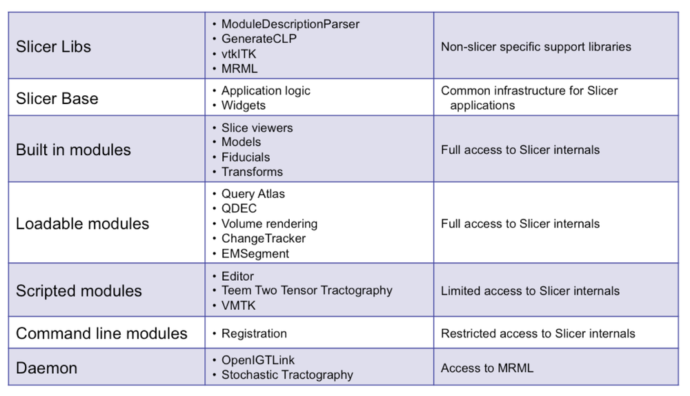
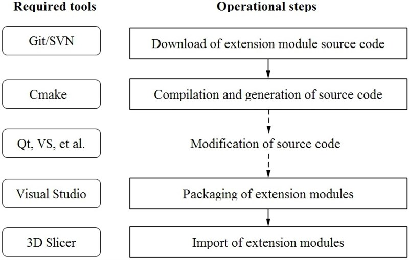

- Slicer Libs
- Slicer Base
- Built in modules
- **C++ loadable modules**：C++编译生成动态链接库
- **CLI modules**:
- **Scripted modules**:如python脚本，最简单的方式
- Daemon 

加粗的三种是我们可以作为扩展比较常用的三种插件形式。

对于c++ loadable module，我们可以通过修改源代码对一些公开的extention进行修改后重新编译并加载到slicer中，具体的流程如下：

