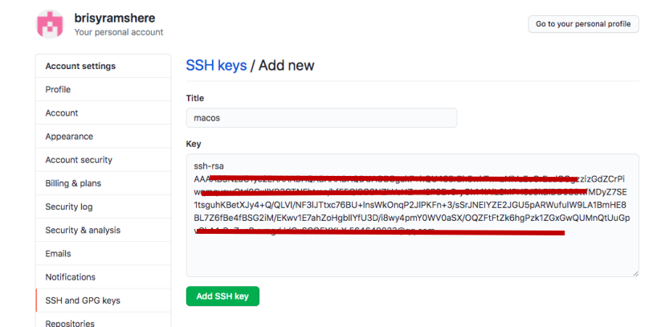

# git账号和ssh配置

如果想要在本地使用git账号，并通过git账号管理代码，包括下载和上传代码，以及分支管理等等，需要将自己的git服务器账号配置在本地。

如此，当使用本地的git命令好，或者其他带gui的git工具时，就能够使用设置好的账号进行代码管理。

因为笔者没有搭建自己的内部git服务器，此处以github这个公开的git服务器为例，设置自己的github账号，并与github的服务器建立ssh连接方式。

## 1 git账号设置

git提供了git config工具进行账号的设置。

例：
```
git config --global user.name "xxx"
git config --global user.email "xxx@qq.com"
```
通过以上命令基本可以完成账号的设置。但是--global代表什么意思？

> git config --local：仓库级别的设置，该设置只对当前仓库适用
>
> git config --global：设置当前用户下的全局用户名
>
> git config --system：设置系统级的用户名，对所有用户适用

- 作用范围：system>global>local
- 优先级：local>global>system (设置有local优先用local，否则看是否有global设置，再次之才会找system账号)

另外，所有的指令其实都是在改配置文件，local,global,system的配置分别对应一下配置文件中的修改（也就是说，也可以直接通过修改对应的配置文件设置账号）：
>local：当前仓库下.git/config
>
>global：～/.gitconfig(当前用户宿主目录下,windows下是c:\users\xxx\.gitconfig)
>
>system：linux下是/etc/gitconfig；windows下是 git安装目录\mingw64\etc\gitconfig

设置完成通常需要查看一下：
>git config --local -l 查看仓库配置
>
>git config --global -l 查看用户配置
>
>git config --system -l 查看系统配置

>git config -l 查看所有配置，依次是系统级别、用户级别和仓库级别

其他指令：
>git config -e 编辑
>
>git config --add 添加
>
>git config --get 获取
>
>git config --unset 取消设置


## 2 ssh密钥设置

### 2.1 为什么需要ssh方式

获取代码到本地有三种方式：
1. http：git clone + http的url。这种方式下载代码没问题，而且不需要任何账号设置。但是当需要fetch和push的时候，每次都需要输入账号和密码。
2. ssh：使用ssh指令克隆或上传代码前，需要先配置和添加好ssh key；且这种方式只能克隆自己账号下的项目；它的好处在于：你只需要配置一次，后面fetch和push代码等操作都不再需要输入账号密码。
3. 官网打包下载

所以，如果只是下载别人的代码，直接http或打包下载都行；如果要用git进行代码管理，ssh是最方便的方式。

### 2.2 配置步骤

#### 1）本地电脑生成密码

先执行以下步骤，在用户宿主目录下创建.ssh文件夹，并在其中生成密密钥：
```
mkdir ~/.ssh
cd ~/.ssh
ssh-keygen -t rsa -C xxxx@qq.com
```
根据提示按回车，3次回车，生成私钥和公钥。私钥自己保留，公钥需要告诉我们要访问的ssh服务器，也就是git服务器。

生成的私钥和公钥：
私钥：.ssh/id-rsa
公钥：.ssh/id_rsa.pub

#### 2）将公钥拷贝给git服务器

本文依然以github为例。登陆自己的github账号忘图示的设置里面填就行了，title可以随便填，key填本地电脑生成的公钥。


